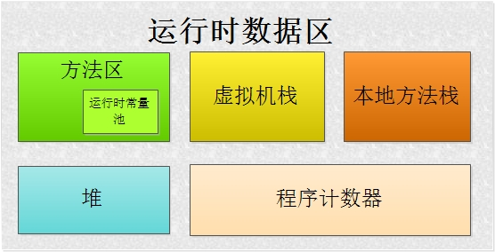

# Java内存区域与内存溢出异常

> 参考书籍：《深入理解Java虚拟机——JVM高级特性与最佳实践》

## 运行时的数据区域

Java虚拟机在执行程序时会将它所管理的内存划分为若干个区域：

|     区域     |                           简介                           | 虚拟机规范规定异常 |
| :----------: | :------------------------------------------------------: | :----------------: |
|  程序计数器  |  当前线程行号指示器 保存的是字节码指令地址或者值为空  |         无         |
| Java虚拟机栈 | Java方法执行的内存模型：每个方法被执行的同时创造一个栈帧 |  栈溢出和内存不足  |
|  本地方法栈  |   与虚拟机栈为Java方法服务相似，该区域为Native方法服务   |  栈溢出和内存不足  |
|    Java堆    |    Java虚拟机管理的最大的一块内存 用于存放对象实例    |    内存不足异常    |
|    方法区    | 存储已被加载的类信息、常量、静态变量、编译器编译后的代码 |    内存不足异常    |

### 程序计数器

程序计数器是一个较小的内存空间。字节码解释器的工作原理就是通过改变这个计数器的值来选取下一条需要执行的字节码指令，分支、循环、跳转、异常处理、线程恢复等基础功能都需要依赖这个技术器来完成。

在任何确定的时刻，一个内核只会执行一条线程中的指令。为了保证线程在切换过程中能够准确的找到之前的运行位置，每一条线程都需要一个程序计数器独立存储线程字节码行号。因此这类内存区域为==“线程私有”的内存==。

**当线程执行的是Java方法时，计数器记录的是正在执行的虚拟机字节码指令的地址；如果是Native方法（该方法为非Java语言实现）的话，则计数器的值为空（Undefined）。因此在这一区域中，没有规定任何`OutOfMemoryError`等异常情况。**

### Java虚拟机栈

与程序计数器一样也是线程私有内存，生命周期与线程相同。大多数人Java内存不那么严谨的分为栈内存和堆内存。其中的堆内存指的就是Java虚拟机栈。 虚拟机栈描述的是Java方法执行的内存模型：每个方法被执行时都会创造一个用于存储局部变量表、操作栈、动态链接、方法出口等信息的栈帧。方法调用对应栈帧入栈，方法执行完毕对应着栈帧的出栈。

这这个区域中，Java虚拟机规定了两种异常状态：

1. 如果线程请求的栈深度大于虚拟机允许的深度，将抛出`StackOverFlowError`异常；
2. 如果虚拟机无法申请到足够的内存时会抛出`OutOfMemoryError`异常。

### 本地方法栈

与虚拟机栈发挥作用相似，其区别为：虚拟机栈为Java方法服务，而本地方法栈为Native方法服务。部分虚拟机（如 Sun HotSpot虚拟机）讲两个栈合二为一。与Java虚拟机栈相同，本地方法栈也会抛出两种异常：`StackOverFlowError`和`OutOfMemoryError`异常

### Java堆（GC堆）

对大多数应用来说，Java堆是Java虚拟机所管理内存中最大的一块。Java堆是所有线程共享的一块内存，在虚拟机启动时创建。该区域唯一的目的就是存放对象实例，即所有的对象实例以及数组都在这里分配内存。

从内存回收角度看，在分代手机算法下，Java堆中还可以细分为：新生代和老年代；如果在细分则为Eden空间、From Survivor空间和To Survivor空间等。

Java堆可以位于物理上不连续的空间中，逻辑上连续即可。如果堆中没有内存完成实例分配，并且堆也无法在扩展时，将会抛出`OutOfMemoryError`异常。

### 方法区

Java方法区和Java堆一样是，是各个线程共享的内存区域。Java虚拟机规范对这个区域的限制非常宽松，可以选择不实现垃圾回收，或者说在这个区域的垃圾回收相比Java堆上 的垃圾回收更少。根据Java虚拟机规范的规定，当方法区无法满足内存分配需求时，将抛出`OutOfMemoryError`异常。

#### 运行时常量池

运行时常量池是方法区的一部分，Class文件中除了有类的版本、字段、方法、接口等描述等信息外，还有一项信息时常量池，用于存放编译期生成的各种字面量和符号引用。这部分内容在类加载后存放到方法区的运行时常量池中。