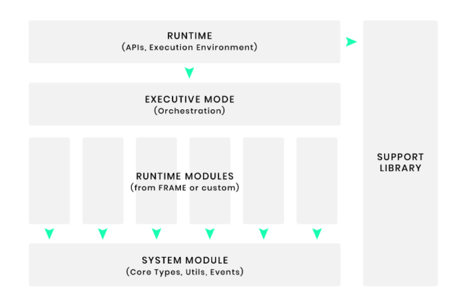

# The note of runtime in Substrate

## Runtime overview

- In substrate-based chains, the runtime is the **"state transition function"** .
   - storage items that are used to represent the blockchain's state and functions.
- runtimes are built as WebAssembly bytecode, in order to provide forkless runtime upgrade capabilities.
- Some primitives that the runtime must implement.

---

- FRAME, the parity's system for Substrate runtime development.
   - defines additional runtime primitives.
   - provides a framework that makes it easy to construct a runtime by composing modules, called "pallet".


## Runtime Primitives

The Substrate runtime is composed with a set of primitives types.

### Core Primitives

Core primitives are mandatory to define and must fulfill a particular interface in order to work within the Substrate framework.

They are:

- `Hash`: A type which encodes a cryptographic digest of some date. just 256-bits quantity.

- `DigestItem`: A type which must be able to encode one of a number of "hard-wired" alternatives relevant to consensus and charge -tracking and any number of "soft-coded" variants, relevant to specific modules within the runtime. 

- `Digest`: A series of `DigestItem`s.

- `Extrinstic`:  A type to represent a single piece of data external to the blockchain that is recognized by the blockchain. 

- `Header`: A type which is representative (cryptographically or otherwise) of all information relevant to a block.

- `Block`: Essentially just a combination of `Header` and a series of `Extrinsic`s, 

- `BlockNumber`: A type which encodes the total number of ancestors any valid block has. Typically a 32-bit quantity.

### Frame Primitives

an additional set of primitives that are assumed about a runtime built with the Substrate FRAME:

- `Call`: The dispatch type that can be called via an extrinsic.
- `Origin`: Represents where a call came from. For example, a signed message (a transaction), an unsigned message (an inherent extrinsic), and a call from the runtime itself (a root call).
- `Index`: An account index (aka nonce) type. This stores the number of previous transactions associated with a sender account.
- `Hashing`: The hashing system (algorithm) being used in the runtime (e.g. Blake2).
- `AccountId`: The type used to identify user accounts in the runtime.
- `Event`: The type used for events emitted by the runtime.
- `Version`: A type which represents the version of the runtime.

```rust
/// A hash of some data used by the chain.
pub type Hash = sp_core::H256;

/// Digest item type.
pub type DigestItem = generic::DigestItem<Hash>;

/// An index to a block.
pub type BlockNumber = u32;

/// Alias to 512-bit hash when used in the context of a transaction signature on the chain.
pub type Signature = MultiSignature;

/// Some way of identifying an account on the chain. We intentionally make it equivalent
/// to the public key of our transaction signing scheme.
pub type AccountId = <<Signature as Verify>::Signer as IdentifyAccount>::AccountId;

/// The type for looking up accounts. We don't expect more than 4 billion of them.
pub type AccountIndex = u32;

/// Balance of an account.
pub type Balance = u128;

/// Type used for expressing timestamp.
pub type Moment = u64;

/// Index of a transaction in the chain.
pub type Index = u32;

/// A timestamp: milliseconds since the unix epoch.
/// `u64` is enough to represent a duration of half a billion years, when the
/// time scale is milliseconds.
pub type Timestamp = u64;

/// Header type.
pub type Header = generic::Header<BlockNumber, BlakeTwo256>;
/// Block type.
pub type Block = generic::Block<Header, OpaqueExtrinsic>;
/// Block ID.
pub type BlockId = generic::BlockId<Block>;
```

## FRAME and Pallets

The **Framework for Runtime Aggregation of Modularized Entities (FRAME)** is a set of modules (called pallets) and support libraries that simplify runtime development. Pallets are individual modules within FRAME that host domain-specific logic.



### System Library

The [System library](https://substrate.dev/rustdocs/v2.0.0/frame_system/index.html) provides low-level types, storage, and functions for your blockchain. All other pallets depend on the System library as the basis of your  Substrate runtime.

The System library defines all the core types for the Substrate runtime, such as:

- Origin
- Block Number
- Account Id
- Hash
- Header
- Version
- etc...

It also has a number of system-critical storage items, such as:

- Account Nonce
- Block Hash
- Block Number
- Events
- etc...

Finally, it defines a number of low level functions which can access your blockchain storage, verify the origin of an extrinsic, and more.